# Introduction

Heap Explorer is a Memory Profiler, Debugger and Analyzer for Unity. This repository hosts Heap Explorer for Unity 2019.3 and newer. For older versions, please visit the now obsolete repository on Bitbucket instead ([link](https://bitbucket.org/pschraut/unityheapexplorer/)).

I spent a significant amount of time identifying and fixing memory leaks, as well as looking for memory optimization opportunities in Unity applications in the past. During this time, I often used Unity's [old Memory Profiler](https://bitbucket.org/Unity-Technologies/memoryprofiler) and while it's an useful tool, I was never entirely happy with it.

This lead me to write my own memory profiler, where I have the opportunity to make all the things I didn't like about Unity's Memory Profiler better™.

Fast-forward about a year, Unity Technologies announced they're working on a Memory Profiler too. This crushed my plans with what I had in mind for Heap Explorer. It was no longer a legit option for me to put a lot of time in the tool, as Unity Technologies tool is at least as good as what I'm able to come up with.

After a lot of back-and-forth what to do with Heap Explorer, I came to the conclusion that the best option is to provide the source code and (mentally) move on. You can read more about this [here](https://forum.unity.com/threads/wip-heap-explorer-memory-profiler-debugger-and-analyzer-for-unity.527949/page-3#post-4250698). 

I've provided occasional updates since then, because several people still prefer Heap Explorer over Unity's Memory Profiler, due to its easier to understand UI/UX.

I've also updated Heap Explorer to work with Unity 2019.3 and converted it into a Package, which means you should be able to use Heap Explorer for the entire 2019 LTS cycle, which ends in 2022.

[](https://www.youtube.com/watch?v=tcTl_7y8JBA "")


# Installation

In order to use the Heap Explorer, you have to add the package to your project. As of Unity 2019.3, Unity supports to add packages from git through the Package Manager window.

In Unity's Package Manager, choose "Add package from git URL" and insert one of the Package URL's you can find below. Once Heap Explorer is installed, you can open it from Unity's main menu under "Window > Analysis > Heap Explorer".


## Package URL's

I recommend to right-click the URL below and choose "Copy Link" rather than selecting the text and copying it, because sometimes it copies a space at the end and the Unity Package Manager can't handle it and spits out an error when you try to add the package.

Please see the ```CHANGELOG.md``` file to see what's changed in each version.

| Version  |     Link      |
|----------|---------------|
| 4.0.0 | https://github.com/pschraut/UnityHeapExplorer.git#4.0.0 |
| 3.9.0 | https://github.com/pschraut/UnityHeapExplorer.git#3.9.0 |
| 3.8.0 | https://github.com/pschraut/UnityHeapExplorer.git#3.8.0 |
| 3.7.0 | https://github.com/pschraut/UnityHeapExplorer.git#3.7.0 |
| 3.6.0 | https://github.com/pschraut/UnityHeapExplorer.git#3.6.0 |
| 3.5.0 | https://github.com/pschraut/UnityHeapExplorer.git#3.5.0 |
| 3.4.0 | https://github.com/pschraut/UnityHeapExplorer.git#3.4.0 |
| 3.3.0 | https://github.com/pschraut/UnityHeapExplorer.git#3.3.0 |
| 3.2.0 | https://github.com/pschraut/UnityHeapExplorer.git#3.2.0 |

# Credits

If you find this package useful, please mention my name in your credits screen.
Something like "Heap Explorer by Peter Schraut" or "Thanks to Peter Schraut" would be very much appreciated.


# Contact

The easiest way to get in touch with me, if you already have an Unity forums account, is to post in the Heap Explorer forum thread:
https://forum.unity.com/threads/wip-heap-explorer-memory-profiler-debugger-and-analyzer-for-unity.527949/

You could also use the "Start a Conversation" functionality to send me a private message via the Unity forums: https://forum.unity.com/members/peter77.308146/

And last but not least, you can send me an email. Please find the contact information on my website:
http://www.console-dev.de


# Can I use this tool when I work on a commercial project?

Yes. You can use Heap Explorer to debug, profile and analyze your hobby-, Indie- and commercial applications for free. You do not have to pay me anything.

If you find Heap Explorer useful, please mention my name in your credits screen.
Something like "Heap Explorer by Peter Schraut" or "Thanks to Peter Schraut" would be very much appreciated.


# How to capture a memory snapshot

Heap Explorer displays the connected Player in the "Capture" drop-down, which you can find in the toolbar. The button is located under a drop-down menu, to avoid clicking it by accident. 
If no Player is connected, Heap Explorer displays "Editor". Clicking the "Editor" button then captures a memory snapshot of the Unity editor.

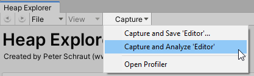

If a Player is connected, Heap Explorer displays the Player name, rather than "Editor". It's the same name that appears in Unity's Profiler window as well.

| Item  |     Description      |
|----------|---------------|
| Capture and Save | Prompts for a save location before the memory snapshot is captured. This feature has been added to allow you  to quickly capture a memory snapshot that you can analyze later, without Heap Explorer analyzing the snapshot, which can be an expensive operation. |
| Capture and Analyze | Captures a memory snapshot and immediately analyzes it. |
| Open Profiler | Opens Unity's Profiler window. In order to connect to a certain target, you have to use Unity's Profiler. As you select a different target (Editor, WindowsPlayer, ...) in Unity's Profiler window, Heap Explorer will update its entry in the "Capture" drop-down accordingly, depending on what is selected in Unity's Profiler. |


# Brief Overview

The Brief Overview page shows the most important "quick info" in a simple to read fashion, such as the top 20 object types that consume the most memory.

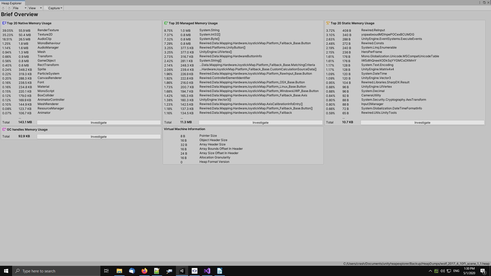


# Compare Memory Snapshots

Heap Explorer supports to compare two memory snapshots and show the difference between those. This is an useful tool to find memory leaks.

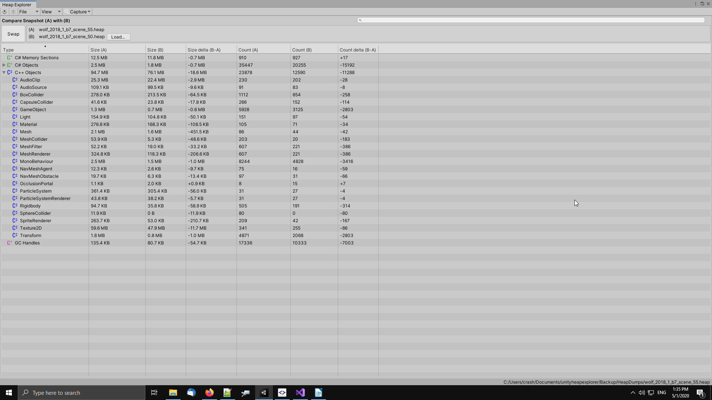

"A" and "B" represent two different memory snapshots.

The "delta" columns indicate changes. The "C# Objects" and "C++ Objects" nodes can be expanded to see which objects specifically cause the difference.

Snapshot "A" is always the one you loaded using "File > Open Snapshot" or captured. While "B" is the memory snapshot that is used for comparison and can be replaced using the "Load..." button in the Compare Snapshot view.


# C# Objects

The C# Objects view displays managed objects found in a memory snapshot. Object instances are grouped by type. Grouping object instances by type allows to see how much memory a certain type is using.

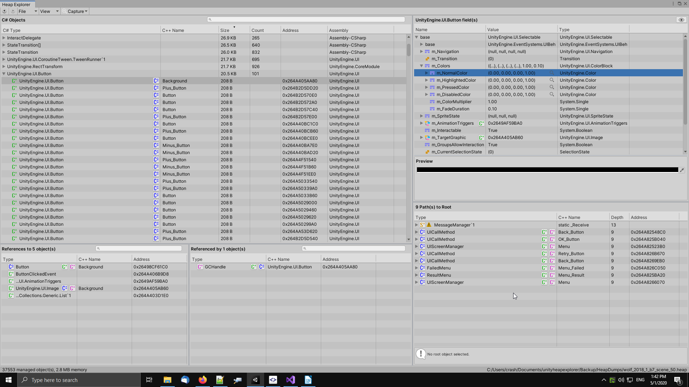

| Location  | Description      |
|----------|---------------|
| Top-left panel | The main list that shows all managed objects found in the snapshot. |
| Top-right panel | An Inspector that displays fields and their corresponding values of the selected object. |
| Bottom-right panel | One or multiple paths to root of the selected object. |
| Bottom-left panel | Objects that hold a reference to the selected object. |

You can left-click on a column to sort and right-click on a column header to toggle individual columns:

| Column  | Description      |
|----------|---------------|
| C# Type | The managed type of the object instance, such as System.String. |
| C++ Name | If the C# object has a C++ counter-part, basically C# types that derive from UnityEngine.Object have, the name of the C++ native object is displayed in this column (UnityEngine.Object.name). |
| Size | The amount of memory a managed object or group of managed objects is using. | 
| Count | The number of managed objects in a group. |
| Address | The memory address of a managed object. |
| Assembly | The assembly (DLL) name in which the type lives. |


# C# Object Inspector

The C# Object Inspector displays fields of a managed object, along with the field type and value. I tried to mimic the feel of Visual Studio's Watch window.

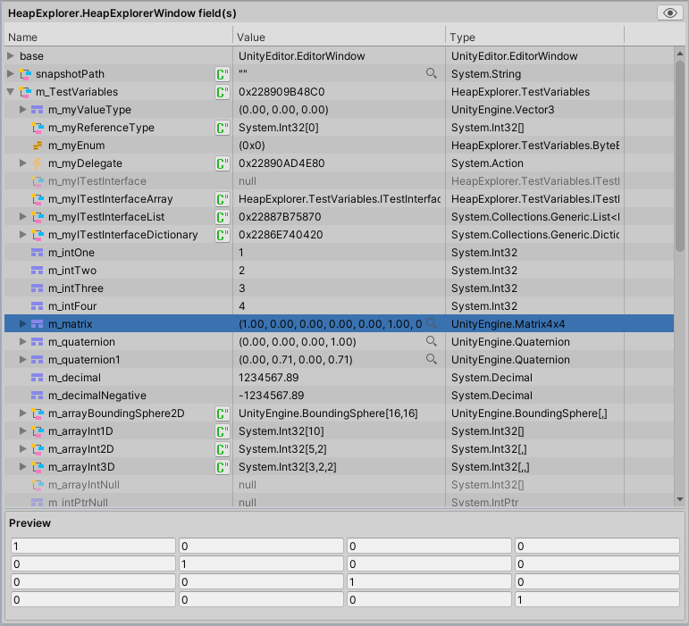

The arrow in-front of the Name indicates the field provides further fields itself, or in the case of an array, provides array elements. Click the arrow to expand, as shown below.

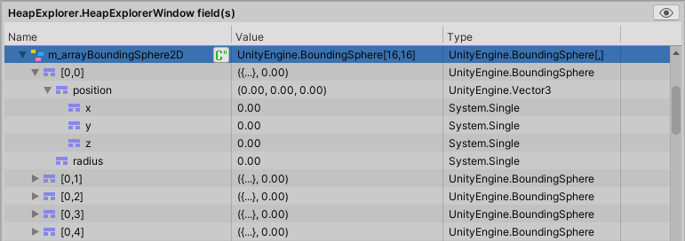

The icon in-front of the Name represents the "high-level type" of a field, such as: ReferenceType, ValueType, Enum and Delegate. If the field is a ReferenceType, a button is shown next to the Name, which can be used to jump to the object instance.

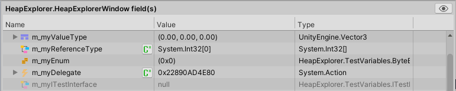

A magnification icon appears next to the value, if the type provides a specific "Data Visualizer". A data visualizer allows Heap Explorer to display the value in a more specific way, tailored to the type, as shown below.

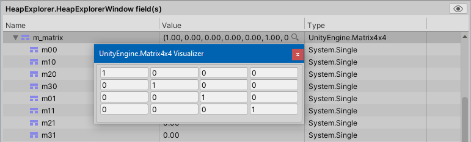

If a field is a pointer-type (ReferenceType, IntPtr, UIntPtr), but it points to null, the field is grayed-out. I found this very useful, because you often ignore null-values and having those grayed-out, makes it easier to skip them mentally.


The eye-like icon in the top-right corner of the Inspector can be used to toggle between the field- and raw-memory mode. I don't know how useful the raw-memory mode is for you, but it helped me to understand object memory, field layouts, etc while I was developing Heap Explorer. I thought there is no need to remove it.

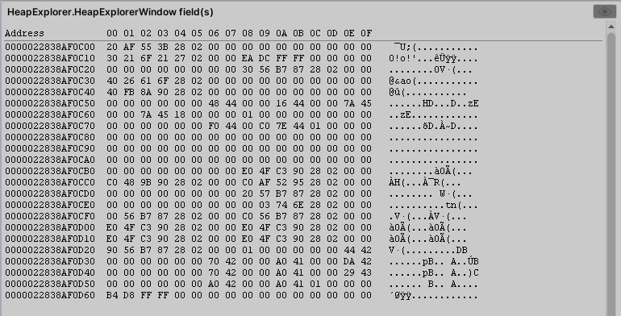


# References / Referenced by

The "References" and "Referenced by" panels show what objects are connected.

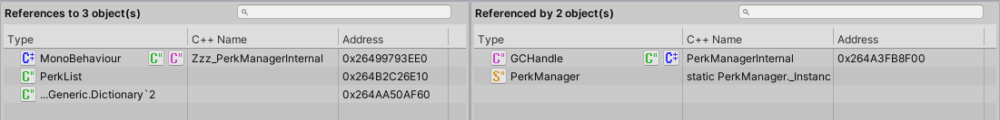

"References" shows the objects that are referenced by the selected object. "Referenced by" is basically the inverse, it shows what other objects hold a reference to the selected object.


# Paths to Root

The Root Path panel is used to show the root paths of an object instance.

A root path is the path of referrers from a specific instance to a root. A root can, for example, be a Static Field, a ScriptableObject, an AssetBundle or a GameObject.

The root path can be useful for identifying memory leaks. The root path can be used to derive why an instance has not been garbage collected, it shows what other objects hold the instance in memory.

The Root Path View lists paths to static fields first, because those are often the cause why an instance has not been garbage collected. It then lists all paths to non-static fields. The list is sorted by depth, meaning shorter paths appear in the list first. Therefore, the "Shortest Path to Root" is shown at the top of the list.

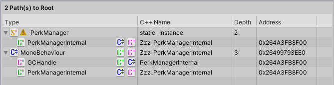

In the example above, Dictionary<Int32,Boolean> is kept in memory, because PerkManagerInternal holds a reference to it. And the static field PerkManager, holds a reference to the PerkManagerInternal object.

If you select a root path, the reason whether an object is kept in memory, is shown in the info message field at the bottom of the Root Path View.

Some types display a warning icon in the Root Path View. This is an indicator that the object is not automatically unloaded by Unity during a scene change for example.

Unity allows to mark UnityEngine.Object objects to prevent the engine from unloading objects automatically. This is can be done, for example, using [HideFlags](https://docs.unity3d.com/ScriptReference/HideFlags.html) or [DontDestroyOnLoad](https://docs.unity3d.com/ScriptReference/Object.DontDestroyOnLoad.html). The Root Path view displays a warning icon next to the type name, if an object is either a static field or uses one of Unity's mechanism to prevent it from being unloaded automatically.


# C# Object Duplicates

The C# Object Duplicates View analyzes managed objects for equality. If at least two objects have identical content, those objects are considered duplicates.

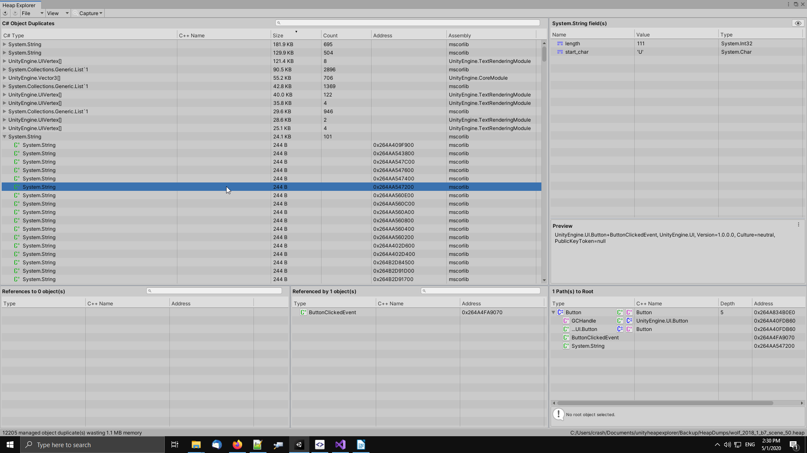

The view groups duplicates by type. If a type, or group, occurs more than once in this view, it means it's the same type, but different content.

For example, if you have ten "Banana" strings and ten "Apple" strings, these would be shown as two "System.String" groups. Two string groups, because both are of the same type, but with different content.

The view can be sorted by various columns. The most interesting ones likely being "Size" and "Count".  Sorting the view by "Size" allows to quickly see where most memory is wasted due duplicated objects.


# C# Delegates

Delegate's often seem to be the cause of a memory leak. I found it useful to have a dedicated view that shows all object instances that are of type System.Delegate.

The C# Delegates View is doing exactly this and behaves just like the regular C# Objects view. It lists all object instances that are a sub-class of the System.Delegate type.

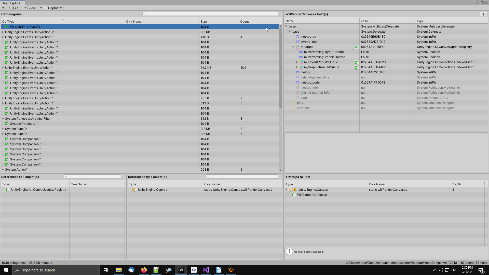

If you select a delegate, its fields are displayed in the inspector (top-right corner of the window) as shown in the image below.

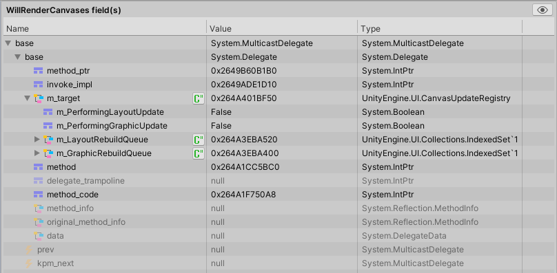

"m_target" is a reference to the object instance that contains the method that is being called by the delegate. "m_target" can be null, if the delegate points a static method.

Want to help me out?
I would really like to display the actual method name of the field "method". However, I didn't find a way how I would look up the name using just its address. It would be a very useful feature. If you know how to do that, please let me know!
https://forum.unity.com/threads/packedmemorysnapshot-how-to-resolve-system-delegate-method-name.516967/


# C# Delegate Targets

The C# Delegate Targets View displays managed objects that are referenced by the "m_target" field of a System.Delegate. The view behaves just like the regular C# Objects view.

Having a dedicated Delegate Targets view allows to quickly see what objects are held by delegates.

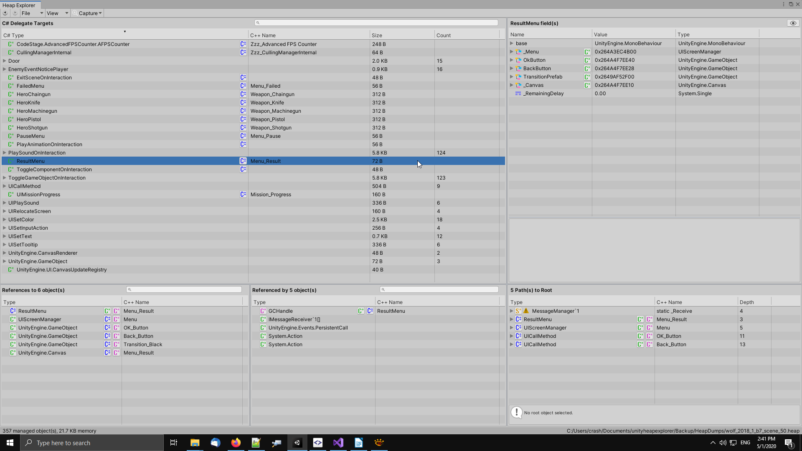


# C# Static Fields

The C# Static Fields view displays managed types that contain at least one static field. Selecting a type displays all of its static fields in the inspector (top-right corner).

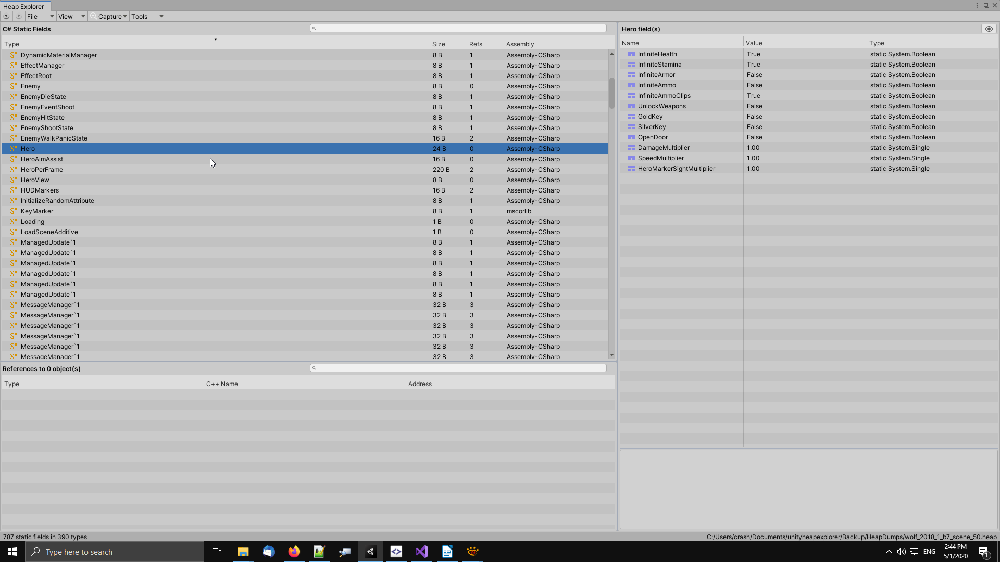

| Question  | Answer      |
|----------|---------------|
| Why is a static type missing? | According to my tests, static field memory is initialized when you first access a static type. If you have a static class in your code, but it is missing in the memory snapshot, it’s likely that your application did not access this class yet. |
| Why does it not display an "Address" column? | Unity’s MemorySnapshot API does not provide at which memory address static field data is located. |
| Where is the Root Path view? | Static fields itself represent a root. There is no need for the Root Path view, because every static type is a root object. |
| Where is the "Referenced By" view? | You can’t reference a static field. However, static fields can reference other objects, that’s why it shows the “References” view. |


# C# Memory Sections

The C# Memory Sections view displays heap sections found in the memory snapshot. 

This view shows how many of those memory sections exist, which gives you an idea of how memory is fragmented. Select a memory section in the left list, to see what objects the sections contains, which are shown in the list on the right.

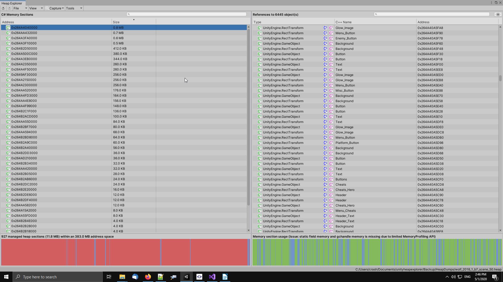


# C++ Objects

The C++ Objects view displays native UnityEngine objects found in a memory snapshot.

Unity offers little information of native objects, unfortunately. While it does provide the size of objects, a lot of data that would be interesting is missing, such as the width/height of a texture for example.

The view has pretty much the same features as the C# Objects view, but it does not provide functionality to inspect native object properties, beside the few ones Unity provides.

The view features the main list that contains all native UnityEngine objects (top-left), the limited information about the selected object in the top-right panel, root paths (bottom-right) and which objects it references and is referenced by.

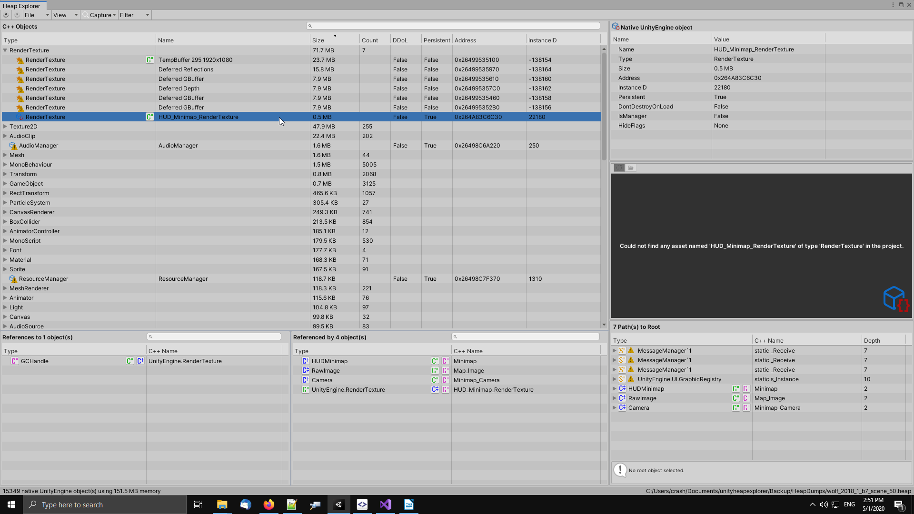

Here is what the C++ objects view displays.

| Column  | Desscription      |
|----------|---------------|
| Type | The native object type. |
| Name | The native object name. This what you can read using [UnityEngine.Object.name](https://docs.unity3d.com/ScriptReference/Object-name.html) |
| Size | The size of a native UnityEngine object that it consumes in memory. |
| Count | The number of native objects of the same type. |
| DDoL | Has this object has been marked as [DontDestroyOnLoad](https://docs.unity3d.com/ScriptReference/Object.DontDestroyOnLoad.html)? |
| Persistent | Is this object persistent? (Assets are persistent, objects stored in scenes are persistent, dynamically created objects are not) |
| Address | The memory address of the native C++ object. This matches the "m_CachedPtr" field of UnityEngine.Object. |
| InstanceID | The UnityEngine.Object.GetInstanceID() value. From my observations, positive id’s indicate persistent objects, while negative id’s indicate objects created during runtime. |
| IsManager | Is this native object an internal Unity manager object? |
| HideFlags | The [UnityEngine.Object.hideFlags](https://docs.unity3d.com/ScriptReference/Object-hideFlags.html) this native object has. |


## Message to Unity Technologies
Unity bug?! Native objects often contain hundreds of millions of references to thousands of completely unrelated objects.
I’m pretty sure this a bug in the Unity editor or engine and reported it as Case 987839:
https://issuetracker.unity3d.com/issues/packedmemorysnapshot-unexpected-connections-between-native-objects
 
The following forum post, shows an actual real example of the problem. Unity creates a connection array of 509.117.918  elements.
https://forum.unity.com/threads/wip-heap-explorer-memory-profiler-debugger-and-analyzer-for-unity.527949/page-2#post-3617188
 
Here is another post in the Profiler forum, which sounds pretty much like the same issue.
https://forum.unity.com/threads/case-1115073-references-to-native-objects-that-do-not-make-sense.608905/


## Exclude NativeObject connections

In order to workaround the major connections bug I described in the text above, where Unity provides more than five hundred million connections, I implemented a feature in Heap Explorer to exclude processing of native object connections.

Unity still captures those connections, but Heap Explorer will not process most of them. While this means Heap Explorer isn't able to show which native object are connected, it's perhaps still better than not being able to capture a snapshot at all.
You can activate this option from Heap Explorer's "File > Settings" menu. The option is called "Exclude NativeObject connections".

Only activate this option if you see Heap Explorer running in this error:
HeapExplorer: Failed to allocate 'new PackedConnection[]'.


# C++ Asset Duplicates (guessed)

The "C++ Asset Duplicates" view is guessing which asset might be duplicates. Unity Technologies explains how to guess if two assets are duplicates on this page:
https://docs.unity3d.com/Manual/BestPracticeUnderstandingPerformanceInUnity2.html

")

The idea is, if you have two assets of the same type and name, but with different instanceID's, these could be duplicates. This approach is of course everything else than reliable, but perhaps better than nothing. Therefore, I implemented this view in Heap Explorer.

The assumption falls apart as soon as the project contains more than one asset with the same name of the same type. For example, if you follow a project structure like shown below, Heap Explorer shows incorrect results.

Heap Explorer incorrectly detects the following textures as duplicates, because they have the same name:
* Assets/Characters/Alien_01/Texture.tga
* Assets/Characters/Alien_02/Texture.tga
* Assets/Characters/Alien_03/Texture.tga


## Message to Unity Technologies
It would be very useful if you store additional information in a “development mode” build, to be able to map a native UnityEngine object in a MemorySnapshot to its asset guid in the project for example. This would allow tools such Heap Explorer to implement some powerful functionality. This additional information should be stripped in non-development builds.

# Search fields

Starting with Heap Explorer 3.9.0, any search-field provides the ability to search
for a specific type. Use ```t:type``` just like in Unity's own search-fields. 
If you want to search for ```RenderTexture``` types, enter ```t:RenderTexture``` in the search-field.


# Enable Heap Explorer tests

In order to enable the Heap Explorer tests, you need Unity's [Test Framework](https://docs.unity3d.com/Packages/com.unity.test-framework@latest) package and set the ```HEAPEXPLORER_ENABLE_TESTS``` define either [Scripting Define Symbols](https://docs.unity3d.com/Manual/class-PlayerSettingsStandalone.html#Other) in Player Settings, or in a [csc.rsp file](https://docs.unity3d.com/Manual/PlatformDependentCompilation.html).


